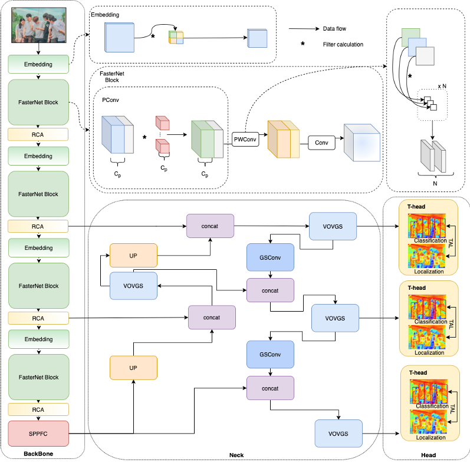

# OLODN:Occlusion-aware Lightweight Object Detection Network

<a href="mailto:2629682663@qq.com"> Sheng Wei</a>

Target detection in densely populated scenarios is particularly critical for real-time systems. However, these scenarios are often limited by hardware computational resources and face occlusion problems between individuals, leading to system delays and reduced detection accuracy. To address this, this paper proposes a lightweight target detection algorithm—the Occlusion-aware Lightweight Object Detection Network (OLODN). The algorithm consists of three parts: the BackBone, the Neck, and the Head. The FasterNet Block is used for feature extraction of the input data, ensuring sufficient receptive fields, while the Reinforced Coordination Attention (RCA) module focuses more on the occlusion boundary information between individuals. To reduce information loss, the Spatial Pyramid Pooling Feature Concatenation (SPPFC) module is used at the end of the BackBone part to enhance the model's ability to recognize individuals of different scales and occluded individuals. In the feature fusion part, the Grouped Shuffle Convolution (GSConv) is employed to improve the flow and integration of features, effectively enhancing feature representation without increasing the computational burden. In the output prediction part, the Task-aligned One-stage Object Detection (TOOD) concept is used to narrow the best anchor points for classification and localization tasks, effectively improving object recognition accuracy under occlusion conditions. Experimental results show that the proposed algorithm achieves a recall rate of 66.8% on the WiderPerson dataset, 2.0% higher than the YOLOv8-n model, with only 1.8M parameters. Its operational efficiency on both CPU and GPU devices is faster than other models. On the UpDown dataset, the classification error rate and the undetected true target error rate are 2.6% and 1.3%, respectively, 0.4% and 0.7% lower than YOLOv8. Experimental validation and subjective and objective evaluation prove the feasibility of the proposed algorithm, which can efficiently handle occlusion problems in densely populated scenarios even on devices with limited computational resources.

Code Run Steps:

~~~shell
conda create -n name python=3.8
pip install -r requirements.txt
~~~

Please run the `train.py` file to introduce the yaml path, and the dataset path.But the train file has to be modified according to the algorithm configuration to change the configuration path as well as the dataset path.

Algorithm Profiles：``OLODN.yaml``,**Be sure to run the code with this project or there will be bugs!**

Please contact the author for the dataset way。swshengwei@foxmail.com

